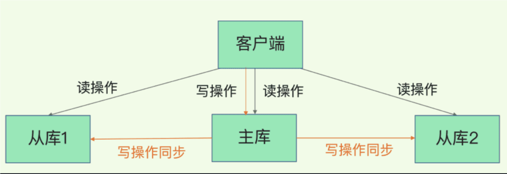

# Redis进阶

## 1.主从复制

### 1.1 主从复制的概念

**（1）基本原理**

- **主节点（Master）**：
  - 主节点是数据的原始源，所有的**写操作**都发生在**主节点**上。
  - 主节点负责接收客户端的写请求和读请求，并将写操作同步到从节点。
- **从节点（Slave）**：
  - 从节点从主节点复制数据，并提供**读操作**的支持。它们从主节点**异步获取数据更新**。
  - 从节点可以用于负载均衡，减轻主节点的负担，尤其是在读取密集型的场景中。

**（2）复制过程**

1. **初始同步**：
   - 当从节点首次与主节点建立连接时，从节点会执行初始同步。这一过程包括：
     - 从主节点获取当前数据的快照（RDB文件或AOF文件的内容）。
     - 从节点从主节点获取快照，并将其加载到内存中，完成数据的初始同步。
2. **持续同步**：
   - 在初始同步完成后，主节点将会将其所有后续的写操作以命令的形式发送给从节点。从节点接收到这些命令后，将会在本地执行，从而保持数据的最新状态。
   - 主从复制是异步的，从节点不立即同步主节点的写操作，因此可能存在短暂的数据不一致。

### 1.2 主从复制的作用

- **数据冗余**：主从复制实现了数据的热备份，是持久化之外的一种数据冗余方式。
- **故障恢复**：当主节点出现问题时，可以由从节点提供服务，实现快速的故障恢复；实际上是一种服务的冗余。
- **负载均衡**：在主从复制的基础上，配合读写分离，可以由主节点提供写服务，由从节点提供读服务（即写Redis数据时应用连接主节点，读Redis数据时应用连接从节点），分担服务器负载；尤其是在写少读多的场景下，通过多个从节点分担读负载，可以大大提高Redis服务器的并发量。
- **高可用基石**：除了上述作用以外，主从复制还是哨兵和集群能够实施的基础，因此说主从复制是Redis高可用的基础。

主从库之间采用的是**读写分离**的方式。

- 读操作：主库、从库都可以接收；
- 写操作：首先到主库执行，然后，主库将写操作同步给从库。



### 1.3 配置主从复制

**（1）配置主节点**

主节点通常不需要特殊的配置来启用主从复制，但在实际应用中，你可能会配置主节点的一些基本参数。以下是主节点的基本配置：

```
# redis.conf 文件中的基本配置（默认情况下 Redis 已启用主从复制功能）
bind 0.0.0.0  # 监听所有网络接口
port 6379     # Redis 默认端口
```

**（2）配置从节点**

从节点的配置需要指定主节点的地址，以便从节点能够连接并从主节点同步数据。可以通过以下方式配置从节点：

**启动时指定主节点**：

启动Redis实例时，可以通过命令行参数指定主节点：

```
redis-server --slaveof <master-ip> <master-port>
```

注意：5.0前用slaveof 后用replicaof 

**从主节点查看信息**

```
redis-cli info replication
```

### 1.4 主从复制的故障处理

在主从复制环境中，可能会遇到以下几种常见故障，并需要采取相应措施进行处理：

**（1）主节点故障**

- **故障转移（Failover）**：

  - 当主节点发生故障时，可以使用哨兵（Redis Sentinel）或其他故障转移机制来自动提升一个从节点为新的主节点。
  - Redis Sentinel提供了自动故障转移、监控和通知等功能。它会检测主节点的健康状态，如果发现主节点故障，会自动将一个从节点提升为新的主节点。

- **手动故障转移**：

  - 如果没有使用Redis Sentinel，您可以手动将一个从节点升级为新的主节点，并将其他从节点重新配置为新的主节点的从节点。

  ```
  # 将从节点提升为主节点
  redis-cli -h <slave-ip> -p <slave-port> replicaof no one
  ```

  然后，在新的主节点上重新配置其他从节点：

  ```
  # 重新配置从节点
  redis-cli -h <new-slave-ip> -p <new-slave-port> replicaof <new-master-ip> <new-master-port>
  ```

**（2）从节点故障**

- **重新同步**：

  - 如果从节点发生故障，可以重新启动从节点并使其与主节点重新同步。通常，从节点会自动尝试重新连接主节点，并恢复数据同步。

- **删除和重新配置**：

  - 如果从节点无法恢复，可以删除从节点的数据并重新配置其与主节点的同步。这样，从节点会执行新的初始同步。

  ```
  # 停止并删除从节点的数据
  redis-cli -h <slave-ip> -p <slave-port> shutdown
  rm /path/to/redis/dump.rdb  # 或 AOF 文件
  redis-server /path/to/redis.conf  # 重新启动 Redis 实例
  ```
  

 **（3）网络分区**

- **网络分区检测**：
  - 当主节点与从节点之间发生网络分区时，可能会导致主节点与从节点的数据不一致。可以使用Redis Sentinel或其他监控工具来检测和处理网络分区问题。
- **修复分区**：
  - 网络问题解决后，需要重新同步数据。可以通过重新启动从节点来重新与主节点同步数据。

## 2.高可用与集群

### 2.1 哨兵模式

**（1）概述**

**哨兵的核心功能：**

在主从复制的基础上，哨兵引入了主节点的自动故障转移。

**哨兵模式的原理 ：**

哨兵(sentinel)：是一个分布式系统，用于对主从结构中的每台服务器进行监控，当出现故障时通过投票机制选择新的 Master 并将所有 Slave 连接到新的 Master。所以整个运行哨兵的集群的数量**不得少于3个节点**。

**故障转移机制：**　　

1.由哨兵节点定期监控发现主节点是否出现故障

每个哨兵节点每隔1秒会向主节点、从节点及其它哨兵节点发送一次ping命令做一次心跳检测。

回复一个错误消息，那么这个哨兵就会认为这个主节点主观下线了（单方面的）。当超过半数

客观下线了。

2.当主节点出现故障，此时哨兵节点会通过Raft算法（选举算法）实现选举机制共同选举出一

故障转移和通知。所以整个运行哨兵的集群的数量不得少于3个节点。

3.由leader哨兵节点执行故障转移，过程如下：

- 将某一个从节点升级为新的主节点，让其它从节点指向新的主节点

- 若原主节点恢复也变成从节点，并指向新的主节点：

- 通知客户端主节点已经更换。

  需要特别注意的是，客观下线是主节点才有的概念；如果从节点和哨兵节点发生故障，被哨兵

障转移操作。

**主节点的选举：**

1. 过滤掉不健康的（已下线的），没有回复哨兵ping响应的从节点。
2. 选择配置文件中从节点优先级配置最高的。（replica-priority，默认值为100）
3. 选择复制偏移量最大，也就是复制最完整的从节点。

哨兵的启动依赖于主从模式，所以必须把主从模式安装好再去做哨兵模式。

**（2）作用** 

- 监控：哨兵会不断地检查主节点和从节点是否运作正常。

- 自动故障转移：当主节点不能正常工作时，哨兵会开始自动故障转移操作，它会将失效主节点的其中一个从节点升级为新的主节点，并让其他从节点改为复制新的主节点。

- 通知（提醒）：哨兵可以将故障转移的结果发送给客户端。

**（3）结构**

哨兵结构由两部分组成，哨兵节点和数据节点：

- 哨兵节点：哨兵系统由一个或多个哨兵节点组成，哨兵节点是特殊的redis节点，不存储数据。
- 数据节点：主节点和从节点都是数据节点。

​     哨兵的启动依赖于主从模式，所以须把主从模式安装好的情况下再去做哨兵模式，所有节点上都需要部署哨兵模式，哨兵模式会监控所有的 Redis 工作节点是否正常，当 Master 出现问题的时候，因为其他节点与主节点失去联系，因此会投票，投票过半就认为这个 Master 的确出现问题，然后会通知哨兵间，然后从 Slaves 中选取一个作为新的 Master。

​	需要特别注意的是，客观下线是主节点才有的概念；如果从节点和哨兵节点发生故障，被哨兵主观下线后，不会再有后续的客观下线和故障转移操作。

**（4）搭建**

在redis根目录下创建一个sentinel.conf文件。

加入配置：

```
#当前Sentinel服务运行的端口
port 16379
#master
#Sentinel去监视一个名为mymaster的主redis实例，这个主实例的IP地址为本机地址127.0.0.1，端口号为6379，
#而将这个主实例判断为失效至少需要2个 Sentinel进程的同意，只要同意Sentinel的数量不达标，自动failover就不会执行
sentinel monitor mymaster 127.0.0.1 6379 2
#指定了Sentinel认为Redis实例已经失效所需的毫秒数。当 实例超过该时间没有返回PING，或者直接返回错误，那么Sentinel将这个实例标记为主观下线。
#只有一个 Sentinel进程将实例标记为主观下线并不一定会引起实例的自动故障迁移：只有在足够数量的Sentinel都将一个实例标记为主观下线之后，实例才会被标记为客观下线，这时自动故障迁移才会执行
sentinel down-after-milliseconds mymaster 5000
#指定了在执行故障转移时，最多可以有多少个从Redis实例在同步新的主实例，在从Redis实例较多的情况下这个数字越小，同步的时间越长，完成故障转移所需的时间就越长
sentinel config-epoch mymaster 14
#如果在该时间（ms）内未能完成failover操作，则认为该failover失败
sentinel leader-epoch mymaster 14
```

使用哨兵命令启动。

```
redis-server sentinel.conf --sentinel
```

